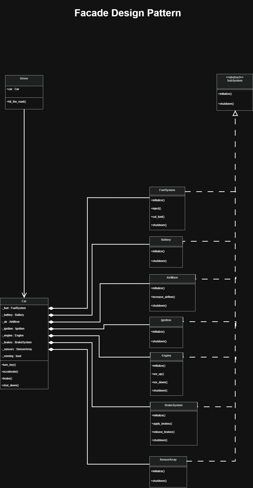

# Facade Design Pattern

## Overview
The **Facade Design Pattern** provides a single, simple "front" to a very complex collection of internal parts. It's used to hide all the complicated details of a system and give the user just a few easy buttons to push.

## Analogy: Starting a Car
Starting a modern car is a massive technical operation.
- The **Battery** must check for a charge.
- The **Fuel System** must inject fuel.
- The **Air Mixer** must prepare the mix.
- The **Ignition** must fire the spark plugs.
- The **Engine** must start the cycles.

As a driver, you don't want to do all that manually. You just **Turn the Key** (the Facade). The car's internal computer handles all those subsystems for you, so you only have to worry about one simple action.

## How the Code Works
1. **The Complex Subsystems**: These are classes like `Engine`, `FuelSystem`, and `Battery`. They each have their own logic and rules for starting and stopping.
2. **The Facade (`Car`)**: This is the easy-to-use class. It "holds" all the subsystems inside it. When you call `turn_key()`, the Facade coordinates all the internal subsystems in the right order.
3. **The Simple Commands**: The driver only ever interacts with the Facade using four methods: `turn_key`, `accelerate`, `brake`, and `shut_down`.
4. **Behind the Scenes**: The Facade uses a "requires_running" check to make sure the car is actually started before you try to drive it, protecting the internal machinery from being used incorrectly.

## Code Snippets

### The Facade (The Car Board)
```python
class Car:
    def __init__(self):
        # The Facade hides multiple subsystems inside
        self._fuel     = FuelSystem()
        self._battery  = Battery()
        self._ignition = Ignition()
        self._engine   = Engine()

    def turn_key(self):
        # COORDINATION: The Facade starts subsystems in order
        self._battery.initialize()
        self._fuel.initialize()
        self._ignition.initialize()
        self._engine.initialize()
```

### The Usage
```python
# The Client (Driver) only knows about the Car
my_car = Car()
driver = Driver(my_car)

# One command from the driver triggers many actions in the car
driver.hit_the_road()
```

## Learning Resources
### Diagrams
- **Online Diagram**: [Facade Pattern Logic](https://app.diagrams.net/#G17v8fd9s0xNFCEDYG-sQaxiaapzijwR4d#%7B%22pageId%22%3A%222D8ie5Ht4-JipBTzvJn7%22%7D)
- **Visual Representation**:


### Presentations
- **Google Slides**: [Facade Pattern Presentation](https://docs.google.com/presentation/d/1MhzZCubXm1gJUo5UqX8FznQ8qs--Mhh-R_EPZh3OsGI/edit?slide=id.g3964482b103_0_347#slide=id.g3964482b103_0_347)
- **Local PPTX**: [facade_pattern.pptx](./facade_pattern.pptx)
