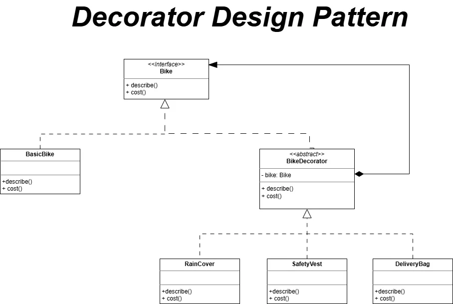

# Decorator Design Pattern

## Overview
The **Decorator Design Pattern** is used to add new features or behaviors to an object "on the fly" without changing its original code. It works by "wrapping" the original object inside another one that adds the extra functionality. This is much more flexible than creating hundreds of subclasses for every possible combination of features.

## Analogy: Dressing Up a Boda Bike
Imagine you have a basic `Boda Boda` (motorcycle). You want to add extra features to it:
- You wrap it with a **Rain Cover** to keep the driver dry.
- You wrap it with a **Delivery Bag** to carry items.
- You wrap it with a **Safety Vest** for visibility.

Notice that the bike itself never changes. You just keep adding "layers" on top of it. You can even combine them however you like (e.g., a bike with just a rain cover, or one with all three).

## How the Code Works
1. **The Base Interface (`Bike`)**: A simple blueprint that says every bike must have a `describe` and `cost` method.
2. **The Core Object (`BasicBike`)**: The simplest version of the bike with a base price and description.
3. **The Wrapper Base (`BikeDecorator`)**: A special class that "holds" a bike inside it. It acts like a bike itself so it can be wrapped again by another decorator.
4. **Specific Decorators (`RainCover`, `DeliveryBag`, etc.)**: These add their own specific cost and description on top of whatever bike they are wrapping. 
5. **The Usage**: You start with a `BasicBike`, then pass it into a `RainCover`, then pass that whole thing into a `DeliveryBag`. When you ask for the final `cost`, it adds up all the layers!

## Code Snippets

### A Specific Decorator (Wrapper)
```python
class RainCover(BikeDecorator):
    def describe(self) -> str:
        return f"{self._bike.describe()} + Rain Cover"

    def cost(self) -> float:
        return self._bike.cost() + 50.0
```

### Creating the "Layered" Object
```python
# Start with the basic bike
my_bike = BasicBike()

# Add a Rain Cover
my_bike = RainCover(my_bike)

# Add a Delivery Bag on top of that
my_bike = DeliveryBag(my_bike)

print(f"Final Build: {my_bike.describe()}")
print(f"Total Cost: {my_bike.cost()}")
```

## Learning Resources
### Diagrams
- **Online Diagram**: [Decorator Pattern Logic](https://app.diagrams.net/#G13kPqKwMNiT_YNGGDOHHRa5g5GPPa0z08#%7B%22pageId%22%3A%22scTOtrB8Ly8LEbTs0GgK%22%7D)
- **Visual Representation**:


### Presentations
- **Google Slides**: [Observer & Decorator Presentation](https://docs.google.com/presentation/d/1Lhkp6iruNAVv0igF7OZ-NmqXXaG_5T1SObMdZMCP_o4/edit?slide=id.g3d06d1b4a46_0_3#slide=id.g3d06d1b4a46_0_3)
- **Local PPTX**: [observer_decorator.pptx](./observer_decorator.pptx)
