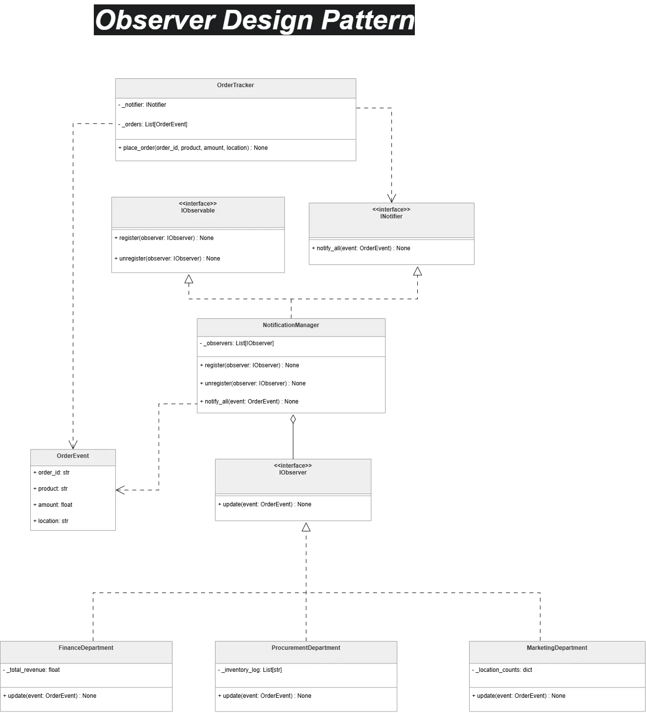

# Observer Design Pattern

## Overview
The **Observer Design Pattern** is like a "Subscription Service." It's used when one object (the **Subject**) needs to automatically update multiple other objects (the **Observers**) whenever its state changes. Instead of each observer constantly asking, "Is there something new?", the Subject simply shouts it out when an event happens.

## Analogy: Company Order Tracking
Imagine a central `OrderTracker` in a company. Whenever a new order arrives, it doesn't wait for departments to check for updates. Instead, it automatically broadcasts the order details to everyone who "subscribed" to the updates:
- **Finance** hears it and updates the revenue.
- **Procurement** hears it and checks the stock.
- **Marketing** hears it and tracks which areas are buying most.

## How the Code Works
1. **The Broadcaster (`OrderTracker`)**: This is the main class that does the business work (processing orders).
2. **The Manager (`NotificationManager`)**: This helper keeps a list of who wants to be notified and knows how to "shout" to all of them at once.
3. **The Listeners (`IObserver`)**: These are the different departments (Finance, Procurement, etc.). They all have a standard way of "hearing" the news (the `update` method) so the Broadcaster doesn't have to worry about how each one works internally.
4. **The Flow**: You add a listener to the manager, and whenever the `OrderTracker` places an order, the manager automatically calls the `update` method on every listener in its list.

## Code Snippets

### The Manager (Broadcaster)
```python
class NotificationManager(INotifier, IObservable):
    def __init__(self):
        self._observers: list[IObserver] = []

    def add_observer(self, observer: IObserver):
        self._observers.append(observer)

    def notify(self, message: str):
        for observer in self._observers:
            observer.update(message)
```

### The Usage
```python
# Create the tracker and manager
manager = NotificationManager()
tracker = OrderTracker(manager)

# Add departments as listeners
manager.add_observer(FinanceDepartment())
manager.add_observer(ProcurementDepartment())

# Place an order - everyone is notified automatically!
tracker.place_order("Laptop", 1200.0, "Nairobi")
```

## Learning Resources
### Diagrams
- **Online Diagram**: [Observer Pattern Logic](https://app.diagrams.net/#G13kPqKwMNiT_YNGGDOHHRa5g5GPPa0z08#%7B%22pageId%22%3A%22YxNO2EB_o2jafiUzlPoN%22%7D)
- **Visual Representation**:


### Presentations
- **Google Slides**: [Observer & Decorator Presentation](https://docs.google.com/presentation/d/1Lhkp6iruNAVv0igF7OZ-NmqXXaG_5T1SObMdZMCP_o4/edit?slide=id.g3d06d1b4a46_0_3#slide=id.g3d06d1b4a46_0_3)
- **Local PPTX**: [observer_decorator.pptx](./observer_decorator.pptx)
